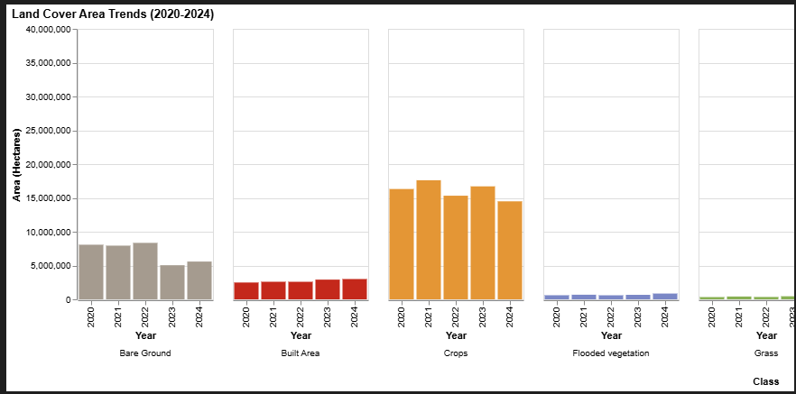
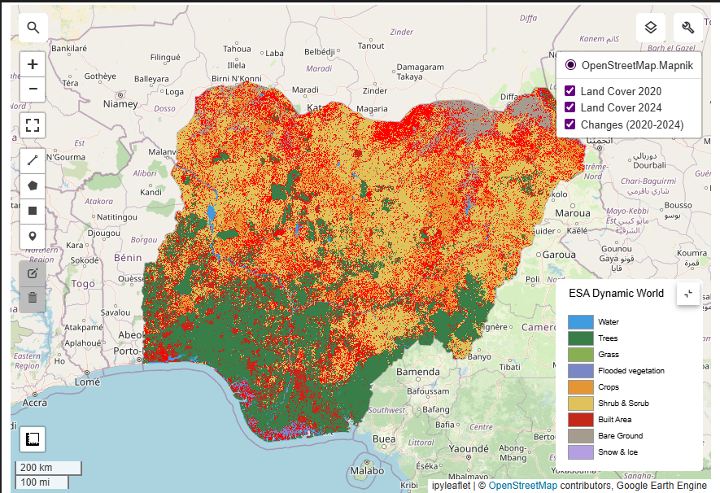
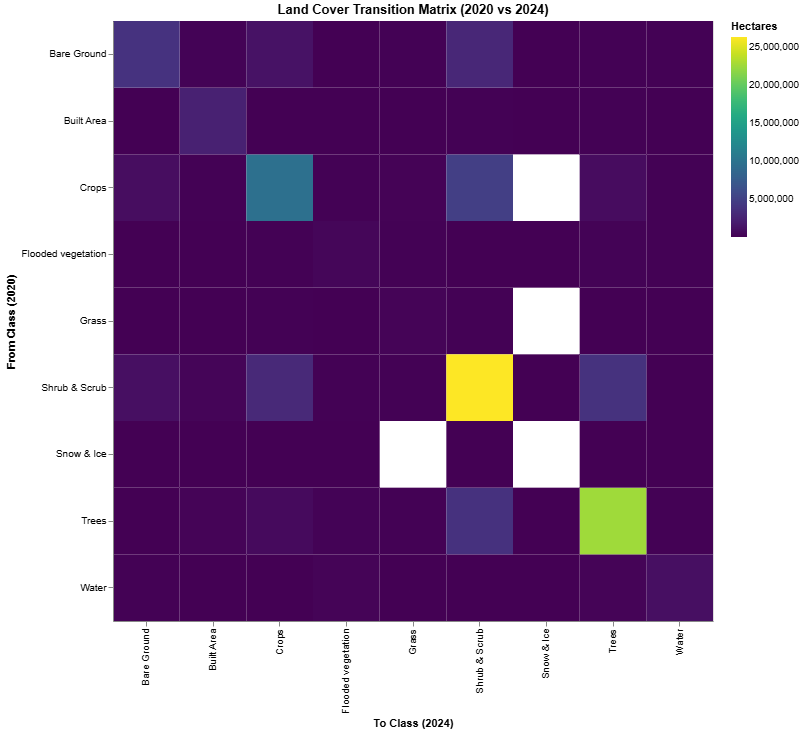

# Land Cover Analysis & Visualization (Nigeria)

## Project Overview
This project analyzes land cover changes in **Nigeria** from **2020 to 2024** using **ESA Dynamic World** data. The analysis is performed using Google Earth Engine (GEE) and Python.

The goal is to understand how land use patterns are shifting over time, with a specific focus on deforestation, urbanization, and agricultural expansion.

## Key Features

### 1. Interactive Area Charts
Visualizes the total area (in hectares) for each land cover class (Trees, Crops, Built Area, etc.) over the 5-year period. This allows for quick identification of major trends.



### 2. Land Cover Maps & Change Detection
- **Annual Maps**: Displays land cover classification for any selected year.
- **Change Detection**: Highlights specific pixels that have changed class between the start and end years, providing a spatial view of dynamic areas.



### 3. Transition Matrix & Robust Insights


A detailed transition matrix quantifies exactly how much land has moved from one class to another. The analysis automatically generates a report on:
- **Deforestation**: Tracking the conversion of forests to crops, bare ground, or built-up areas.
- **Urbanization**: Measuring the expansion of built-up areas (cities, towns, infrastructure).
- **Agricultural Expansion**: Quantifying the increase in crop areas.
- **Forest Regrowth**: Identifying areas where tree cover has increased.

## Usage
1.  Open `LandCover_Analysis_Nigeria.ipynb` in Jupyter Notebook or VS Code.
2.  Ensure you have the required packages installed:
    ```bash
    pip install geemap earthengine-api rasterio geopandas matplotlib numpy seaborn pandas folium ipyleaflet altair
    ```
3.  Run the cells sequentially. You may need to authenticate with Google Earth Engine on the first run.

## Data Source
- **ESA Dynamic World V1**: A near real-time 10m resolution global land use/land cover dataset.

## Results

### Key Findings (2020-2024)
*   **Total Area Analyzed**: 90,884,008 ha
*   **Total Area Changed**: 24,850,377 ha (27.3% of the country experienced land cover change)

#### 1. Deforestation
*   **Total Forest Loss**: 4,513,211 ha
*   **Main Drivers**:
    *   Conversion to **Shrub & Scrub**: 3,680,130 ha
    *   Conversion to **Crops**: 588,340 ha
    *   Conversion to **Built Area**: 233,747 ha

#### 2. Urbanization
*   **New Built Area**: 685,535 ha (Expansion of cities and infrastructure)

#### 3. Agricultural Expansion
*   **New Crop Area**: 4,854,482 ha

#### 4. Forest Regrowth
*   **New Tree Cover**: 4,929,006 ha (Areas transitioning back to trees)

### Land Cover Area Trends (2020 vs 2024)
| Class | 2020 Area (ha) | 2024 Area (ha) | Change (ha) |
| :--- | :--- | :--- | :--- |
| **Trees** | 27,296,365 | 27,472,201 | +175,836 |
| **Shrub & Scrub** | 34,344,532 | 37,717,023 | +3,372,491 |
| **Crops** | 16,315,632 | 14,494,429 | -1,821,203 |
| **Built Area** | 2,487,871 | 3,002,109 | +514,238 |
| **Bare Ground** | 8,078,212 | 5,585,209 | -2,493,003 |
| **Water** | 1,436,436 | 1,189,415 | -247,021 |

### Transition Matrix (2020 vs 2024)
| Start \ End | Bare Ground | Built Area | Crops | Flooded vegetation | Grass | Shrub & Scrub | Snow & Ice | Trees | Water |
| :--- | :--- | :--- | :--- | :--- | :--- | :--- | :--- | :--- | :--- |
| **Bare Ground** | 3,771,756 | 113,784 | 1,183,524 | 26,569 | 34,043 | 2,844,125 | 7 | 50,677 | 53,692 |
| **Built Area** | 4,608 | 2,316,575 | 14,680 | 333 | 132 | 56,933 | 5 | 92,810 | 1,792 |
| **Crops** | 802,578 | 73,429 | 9,639,947 | 59,114 | 148,988 | 4,799,782 | 0 | 751,673 | 40,121 |
| **Flooded veg** | 6,497 | 857 | 34,350 | 354,575 | 34,288 | 15,295 | 27 | 104,576 | 52,761 |
| **Grass** | 6,748 | 117 | 54,892 | 24,409 | 169,253 | 35,426 | 0 | 32,339 | 9,817 |
| **Shrub & Scrub** | 946,766 | 260,683 | 2,964,141 | 43,825 | 95,882 | 26,277,792 | 3 | 3,722,577 | 32,863 |
| **Snow & Ice** | 1 | 1 | 1 | 4 | 0 | 2 | 0 | 6 | 1 |
| **Trees** | 10,994 | 233,747 | 588,340 | 118,627 | 79,650 | 3,680,130 | 61 | 22,543,195 | 37,830 |
| **Water** | 35,261 | 2,917 | 14,553 | 228,499 | 5,191 | 7,536 | 137 | 174,348 | 960,538 |
