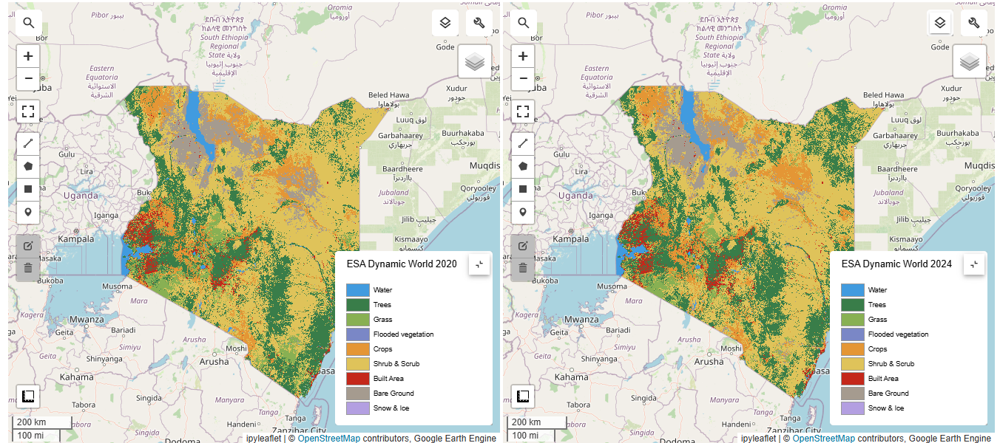
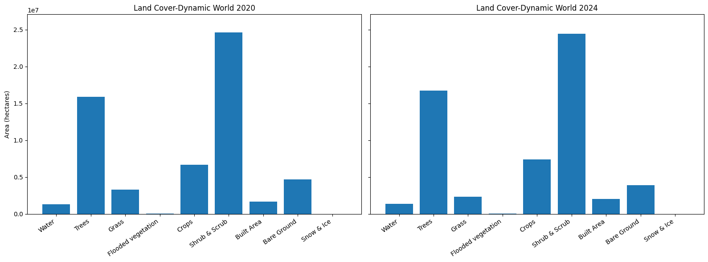
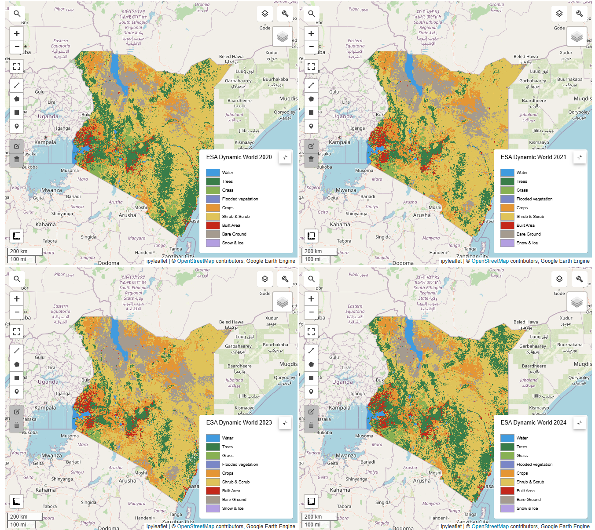
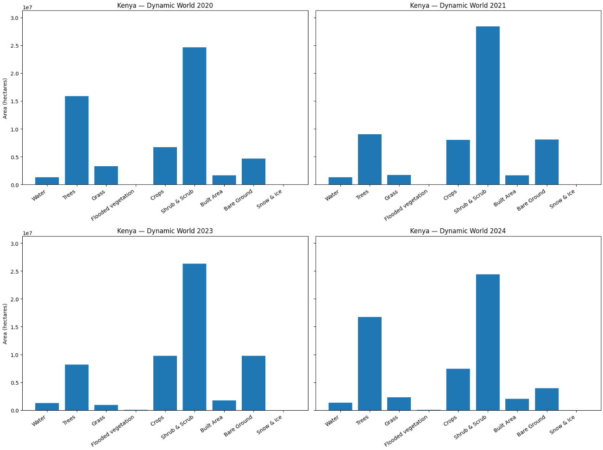

# Overview

Google Earth Engine (GEE) workflow analyzing ESA Dynamic World land use/land cover (LUC) in **Kenya** for **2020–2024**. It includes annual composites, side-by-side map comparisons (2020 vs 2024), fast area statistics (hectares) by class, 2×2 map/chart panels, and optional county-level and change/transition analyses.

All analysis notebooks live under **`Projects/`** so the repo root stays clean.

## Tools used
- **Google Earth Engine (Python API)**  
- **geemap** (interactive maps in notebooks)  
- **Jupyter Notebook**  
- **pandas / matplotlib**  
- **FAO GAUL** admin boundaries (level 0 & level 1)  
- **ESA Dynamic World** (`GOOGLE/ESA/DYNAMICWORLD/V1`)

## Methodology
1. **AOI**: Kenya polygon from `FAO/GAUL/2015/level0` (optionally simplified for speed).
2. **Annual LULC (2020–2024)**: Mode of monthly `label` band → one image per year.
3. **Visualization**: AOI maps with title, legend, lat/lon grid; linked side-by-side maps for 2020 vs 2024; 2×2 year panel.
4. **Stats**: Grouped reducer (`sum(pixelArea)` by `label`) → **hectares per class**; side-by-side bar charts (shared y-axis).
5. **(Optional)** County zonal stats (`GAUL/2015/level1`) and change/transition tables between years.

## Results (examples)
> Land Cover map for 2020 & 2024

> Land Cover graph for 2020 & 2024

> Land Cover from 2020-2024

> Land Cover graph for 2020-2024

> File names may vary depending on parameters you run.

## Links
- ESA Dynamic World (GEE): `GOOGLE/ESA/DYNAMICWORLD/V1`  
- Earth Engine sign-up: https://signup.earthengine.google.com/  
- geemap docs: https://geemap.org/  
- FAO GAUL (GEE): `FAO/GAUL/2015/level0`, `FAO/GAUL/2015/level1`

## How to run
```bash
conda create -n gee_env python=3.10 -y
conda activate gee_env
pip install earthengine-api geemap pandas matplotlib ipywidgets
earthengine authenticate   # or: python -m ee.cli authenticate
jupyter notebook
