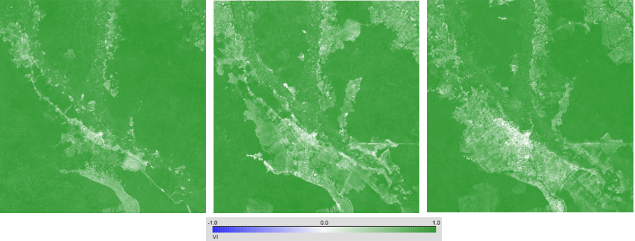
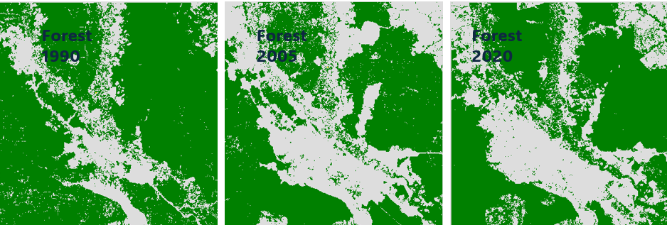
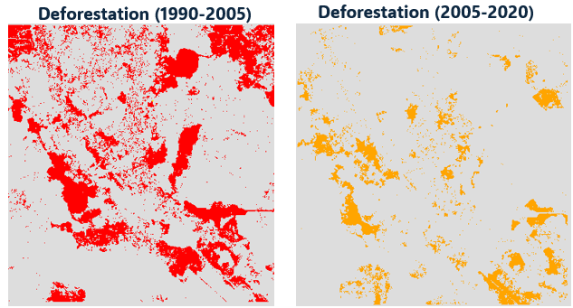
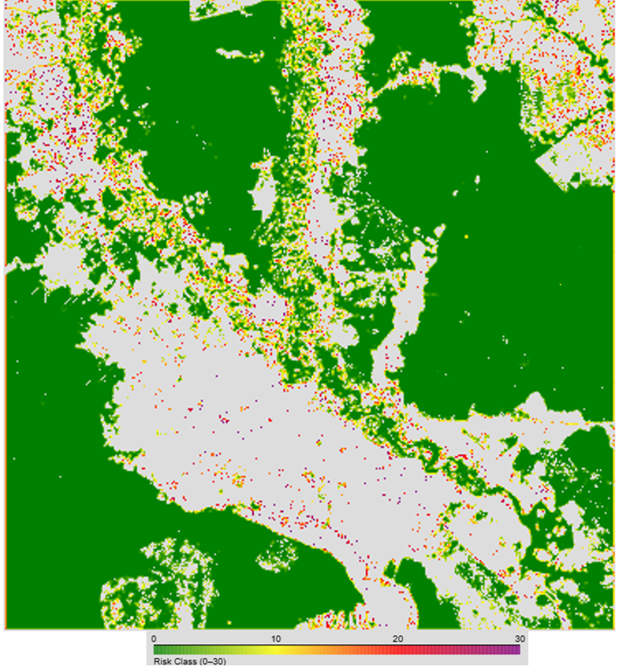
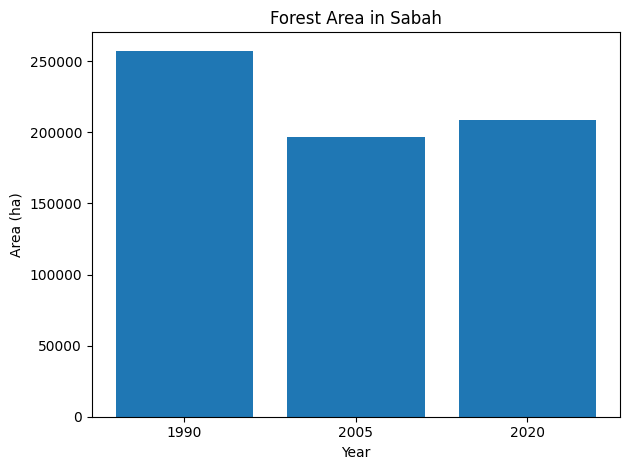

# README — Palangkara Deforestation & Risk Mapping (1990, 2005, 2020)

This guide walks you through creating a Landsat-based **deforestation** and **risk** analysis in **Google Earth Engine (EE)** using a **Jupyter notebook** (VS Code).

---

##  What this does

- Builds median **Landsat composites** around target years **1990, 2005, 2020** (±1 year window)  
- Cloud/shadow masking using **Collection 2 Level-2** QA bits  
- Computes a simple VI: **(NIR–SWIR) / (NIR+SWIR)** and thresholds **VI > 0.7** as forest  
- Identifies **deforestation** in two periods: **1990–2005** and **2005–2020**  
- Computes **forest area (ha)** per year and **deforestation area (ha)** per period  
- Estimates **FAO annual deforestation rate** 1990–2020  
- Builds a **continuous risk map** (equal-interval classes 0–30) using a **focal kernel**  
- Produces **interactive maps**, **tables**, and **charts**

---

##  Data sources

- **Landsat Collection 2, Tier 1, Level-2 (Surface Reflectance)**
  - `LANDSAT/LT04/C02/T1_L2` (Landsat 4 TM)
  - `LANDSAT/LT05/C02/T1_L2` (Landsat 5 TM)
  - `LANDSAT/LC08/C02/T1_L2` (Landsat 8 OLI)
  - `LANDSAT/LC09/C02/T1_L2` (Landsat 9 OLI-2)
- **Admin boundaries** (optional for summaries): `FAO/GAUL/2015/level1` and `level2`

Scaling used (per C02 L2):  
`reflectance = DN * 0.0000275 - 0.2`

---

##  Prerequisites

- **Google Earth Engine account** 
- **Python 3.9+**, **VS Code**, **Jupyter** extension  
- Python packages (auto-installed by the notebook if missing):
  - `earthengine-api`, `geemap`, `pandas`, `matplotlib`

---


##  Parameters 
- **Years:** `year_list = [1990, 2005, 2020]`  
- **Date window:** currently ±1 year around each target year  
- **Forest threshold:** `VI > 0.7` — tune this (e.g., 0.6–0.8) and validate visually  
- **Risk kernel:** low-memory notebook uses `ee.Kernel.square(120, "meters")`  
- **Scale for stats:** 120 m in low-memory mode; 30 m for final exports

---

##   Results

- **Interactive maps**:
  - `SR_1990`, `SR_2005`, `SR_2020` (false-color B5/B6/B2)
  
  - `VI_YYYY` layers  
  
  - `Forest_YYYY` (green mask)  
  
  - `Deforestation 1990–2005` (red) and `2005–2020` (orange)  
  
  - **Risk Equal Interval** (0–30, green→yellow→red→purple) + legend

- **Tables**:
  - Forest area by year (ha)
  - Deforestation area by period (ha)

- **Charts**:
  - Bar chart of forest area by year
  

---

##  Exporting GeoTIFFs 

###  Export from **geemap** (notebook, to local)
```python
from geemap import ee_export_image

# Example: export 2020 forest mask
ee_export_image(
    image=year_products[2020]["forest"].unmask(0).toByte(),
    filename="forest_2020.tif",
    region=roi,
    scale=30,
    file_per_band=False
)
```

###  Export to **Google Drive** (server-side EE)
```python
task = ee.batch.Export.image.toDrive(
    image=year_products[2020]["forest"].unmask(0).toByte(),
    description="forest_2020",
    folder="gee_exports",
    fileNamePrefix="forest_2020",
    region=roi,
    scale=30,
    maxPixels=1e13
)
task.start()
```

Use the same pattern for `deforestation` layers or `riskEq`. For risk, export at 120 m or 30 m (30 m may require smaller ROI or more memory).

---


### Threshold tuning / validation
- Try VI thresholds 0.6–0.8 and inspect forest edges  
- Cross-check with known landcover (e.g., ESA CCI LC) for spot validation

---

##  Method notes & assumptions

- **Compositing window**: ±1 year around each target year improves image count and cloud-free coverage.  
- **Forest definition**: VI > 0.7 is conservative; adjust to context.  
- **Deforestation logic**: pixels forested at period start and **not** forest at period end.  
- **Risk**: a smoothed neighborhood of categorical states, scaled to 0–30 via robust percentiles. In low-memory mode we use a **meter-based kernel** (≈9×9 @30 m) and avoid reprojection for display.

---

##  Reproducibility checklist

- Fix your **AOI** in the first code cell.  
- Keep **year list**, **VI threshold**, **scale**, and **kernel size** recorded.  
- Note Landsat collection versions (C02/T1_L2).  
- Log the date/time you ran the notebook (Landsat collections can be updated over time).

---


**Areas in hectares (memory-safe)**
```python
def area_ha(mask_img, geom, scale=120):
    return ee.Image.pixelArea().divide(10000).updateMask(mask_img).reduceRegion(
        reducer=ee.Reducer.sum(),
        geometry=geom,
        scale=scale,
        bestEffort=True,
        maxPixels=1e13
    ).getNumber('area')
```

**Risk (low-memory display)**
```python
k = ee.Kernel.square(120, "meters", True)
risk = (forest_raster.convolve(k)
        .updateMask(forest_2020)
        .abs()
        .multiply(-1)
        .rename("risk"))
```

---

##  License & attribution

- **Landsat data**: USGS/NASA, public domain  
- **GAUL boundaries**: FAO GAUL 2015 (subject to FAO terms)  


